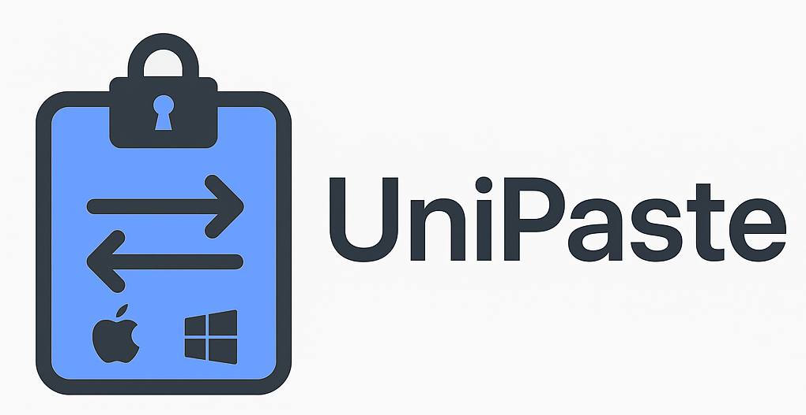

# UniPaste: Secure Cross-Platform Clipboard Sync Tool
[简体中文](/README.md)|[English](/README_EN.md)




 


UniPaste is an end-to-end encrypted cross-platform clipboard synchronization tool that enables secure sharing of clipboard content between Mac and Windows devices. No cloud services required, protecting your data privacy.

## ✨ Features

- **Peer-to-Peer Topology**: Both macOS and Windows can advertise, accept, and initiate connections
- **Real-time Sync**: Instantly synchronize clipboard content between devices
- **End-to-End Encryption**: All transmitted data is protected with AES-256-GCM encryption
- **Zero-Config Networking**: Automatically discover devices on your local network without manual IP configuration
- **Clipboard Loop Prevention**: Smart detection prevents infinite clipboard content loops between devices
- **Multi-Peer Support**: Keep multiple devices connected at the same time
- **Chunked File Transfer**: Large files are streamed in chunks and can resume after reconnect
- **Background Native Flow**: Windows runs from the system tray and macOS can install a LaunchAgent for login startup
- **Simple Control Panel**: Review live status, discovered peers, and pending pairing requests
- **Multiple Content Types**: Support for text and file path transfers

## 📥 Installation

### Direct Installation
Download the latest package from the [Releases](https://github.com/Kookiejarz/UniPaste/releases) page.

### Prerequisites
- Python 3.9 or higher
- pip package manager

### Install from Source

```sh
# Clone repository
git clone https://github.com/Kookiejarz/UniPaste.git
cd UniPaste

# Install dependencies
pip install -r requirements.txt
```

## 🚀 Usage

### Start macOS Node
```sh
python mac_clip_check.py 
```

### Start Windows Node
```sh
python windows_client.py
```

Windows stays in the system tray after launch.  
To enable login startup on macOS:

```sh
python mac_clip_check.py --install-launch-agent
```

## 📋 Practical Usage Flow

1. Start the macOS node and the Windows node in any order
2. Approve the first pairing request on a trusted device
3. The peers will discover each other and choose a single connection direction from their device IDs
4. Once connected, clipboard content stays synchronized across all connected devices
5. File transfers continue in chunks and can resume after reconnect

To run macOS in background-only mode:

```sh
python mac_clip_check.py --headless
```

## 🔒 Encryption Technology Details

UniPaste uses multi-layered encryption technology to ensure data security:

- **Elliptic Curve Diffie-Hellman (ECDHE)**: Securely negotiate shared keys without pre-shared secrets
- **HKDF Key Derivation**: Securely derive encryption keys from shared secrets
- **AES-256-GCM**: Advanced Encryption Standard with Galois/Counter Mode for data confidentiality and integrity

## 🛠 Local Development Environment

```sh
git clone https://github.com/Kookiejarz/UniPaste.git
cd UniPaste
pip install -r requirements.txt
```

## ⚠️ Security Considerations

- This tool is designed for use on secure networks only
- Not recommended for use on public or untrusted networks, which may lead to data leakage
- Check GitHub page regularly for security updates
- Only use between trusted devices

## 🔍 Troubleshooting

### Cannot Discover Devices
- Ensure both devices are on the same local network
- Check firewall settings, make sure **mDNS (UDP 5353)** and **WebSocket (TCP 8765)** ports are open
- Network might be blocking mDNS traffic, try using a wired connection or manually specifying IP addresses

### Decryption Errors
- Ensure both ends are using the same encryption protocol version
- Check if key hashes shown in run logs match
- Restart applications on both ends to resynchronize key states

### Clipboard Not Updating
- Some applications may lock the clipboard, try closing these applications
- Windows permission issues may prevent clipboard writing, try running with **administrator privileges**
- Check application logs for more detailed error information


## Acknowledgements

- **[Zeroconf](https://github.com/jstasiak/python-zeroconf)** for network service discovery
- **[websockets](https://github.com/aaugustin/websockets)** for WebSocket implementation
- **[cryptography](https://github.com/pyca/cryptography)** for cryptography tools
- **[pyperclip](https://github.com/asweigart/pyperclip)** for clipboard operations

## 📄 License

This project is licensed under the GNU-GPL License. See the [LICENSE](LICENSE) file for details.

## 🤝 Contributing

Pull requests and issues are welcome! For major changes, please open an issue first to discuss what you would like to change.
